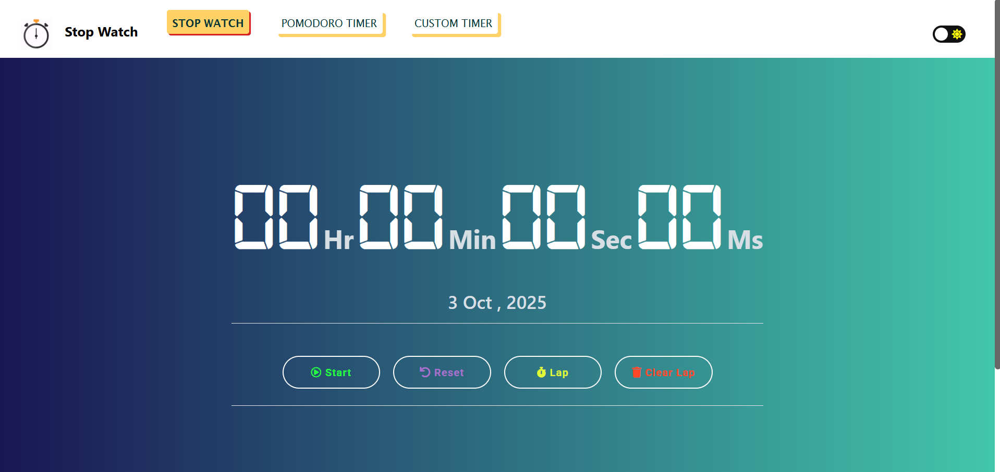
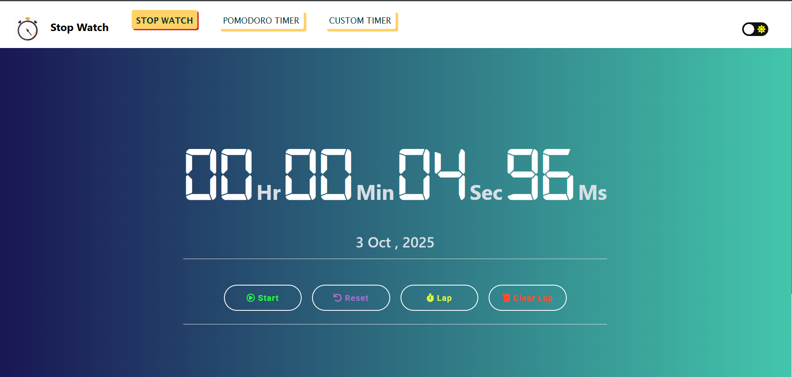
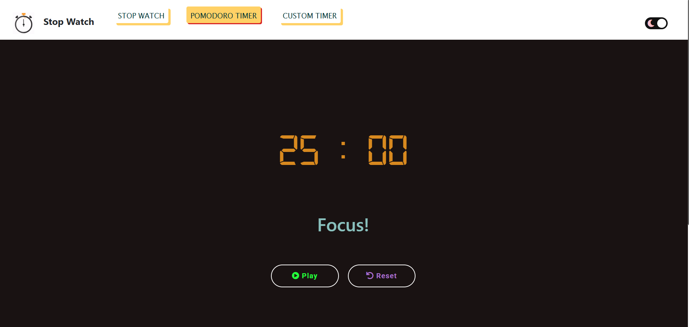
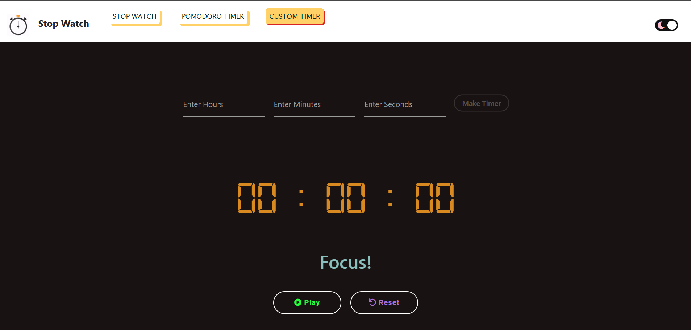

<h1>Stop Watch</h1>

**Web link** - https://avinash201199.github.io/stopwatch/

- **Time** is the most essential part of everyone's life and keeping track of this time is equally important.
  <br>
- A **clock** helps us in our quest to utilize our time efficiently. To assist you to excel in this quest we are building a digital stopwatch.
  <br>
- This **stopwatch** represents the time in **DD:HH:MM: SS** `(day:hour:minute: second)` format, making it easy to keep track of our time.
  <br>
- The functionalities of **Start, Stop, Reset, Lap, and Clear Lap** are accessible with a click of a button.
  <br>
- **Keyboard shortcuts** are now available for enhanced productivity:
  - **Space** or **P** - Start/Stop the stopwatch
  - **Backspace** or **R** - Reset the stopwatch
  - **Enter** - Add a lap
  - **Numpad 0** - Clear all laps
  - **K** - Play/Pause background music
  <br>
- **Custom Timer** with enhanced UI features including time completion animations, sound alerts, and confetti celebrations.
  <br>
- **Pomodoro Timer** with consistent styling and footer layout across all pages.
  <br>
- To enhance the visual appearance it can be viewed in **both dark and light modes,** making it easier to access at all times, along with a responsive website to maximize the user experience.
  <br>


<h1>Tech Stack</h1>

<!--   -->

<h3><li>Html</li></h3>
<h3><li>Css</li></h3>
<h3><li>Javascript</li></h3>

## ✨ Features

- ⏲️ Displays time in **DD:HH:MM:SS** format
- ▶️ Functionalities: **Start, Stop, Reset, Lap, Clear Lap**
- 🌗 **Dark & Light mode** support
- 📱 Fully **responsive UI** (mobile, tablet, desktop)
- ⚡ **Simple, lightweight, and fast**
- ⏳ **Custom Timer** – set your own countdown
- 🍅 **Pomodoro Timer** – focus with the classic Pomodoro technique

## **Note: First create an issue then make a pull request :)**

## **How to be a contributor to the project 😎**<br>

### **1. Star The Repo :star2:**

- Star this repository by pressing the top-rightmost button to start your incredible journey.
- Create an issue describing how you want to contribute to this project.

### **2. Fork it :fork_and_knife:**

- Then fork this repository by using the <kbd><b>Fork</b></kbd> button on top-right of your screen.

- In the forked repository add your changes.

### **3. Clone it :busts_in_silhouette:**

`NOTE: commands are to be executed on Linux, Mac, and Windows(using Powershell)`

- You need to clone (download) it to a local machine using

```sh
$ git clone https://github.com/Your_Username/stopwatch.git
```

> This makes a local copy of the repository in your machine.

- Then make a pull request with the issue number.
- Once you have cloned the stopwatch repository in Github, move to that folder first using the change directory command on Linux, Mac, and Windows(PowerShell to be used).

```sh
# This will change the directory to a folder stopwatch
$ cd stopwatch
```

Move to this folder for all other commands.

### **4. Set it up ⬆️**

- Run the following commands to see that your local copy has a reference to your forked remote repository in Github :octocat:

```sh
$ git remote -v
origin  https://github.com/Your_Username/stopwatch.git (fetch)
origin  https://github.com/Your_Username/stopwatch.git (push)
```

Now, let's add a reference to the original stopwatch repository using

```sh
$ git remote add upstream https://github.com/avinash201199/stopwatch.git
```

This adds a new remote named upstream.

See the changes using

```sh
$ git remote -v
origin    https://github.com/Your_Username/stopwatch.git (fetch)
origin    https://github.com/Your_Username/stopwatch.git (push)
upstream  https://github.com/Remote_Username/stopwatch.git (fetch)
upstream  https://github.com/Remote_Username/stopwatch.git (push)
```

In your case, you will see

```sh
$ git remote -V
origin    https://github.com/Your_Username/stopwatch.git (fetch)
origin    https://github.com/Your_Username/stopwatch.git(push)
upstream  https://github.com/ietebitmesra/stopwatch.git (fetch)
upstream  https://github.com/ietebitmesra/stopwatch.git (push)
```

### **5. Sync it ♻️**

- Always keep your local copy of the repository updated with the original repository. Before making any changes and/or in an appropriate interval, run the following commands carefully to update your local repository.

```sh
# Fetch all remote repositories and delete any deleted remote branches ``
$ git fetch --all --prune
```

```sh
# Switch to `master` branch
$ git checkout master
```

```sh
# Reset local `master` branch to match the `upstream` repository's `master` branch
$ git reset --hard upstream/master
```

```sh
# Push changes to your forked `stopwatch` repo
$ git push origin master
```

### **6. Ready Steady Go... 🐢 🐇**

- Once you have completed these steps, you are ready to start contributing by checking our Help Wanted Issues and creating pull requests.

### **7. Create a new branch ‼️**

- Whenever you are going to contribute. Please create a separate branch using command and keep your master branch clean (i.e. synced with remote branch).

```sh
# It will create a new branch with name Branch_Name and switch to branch Folder_Name
$ git checkout -b BranchName
```

- Create a separate branch for contribution and try to use the same name of the branch as of folder.

To switch to the desired branch

```sh
# To switch from one folder to other
$ git checkout BranchName
To add the changes to the branch. Use
```

```sh
# To add all files to branch Folder_Name
$ git add .
Type in a message relevant for the code reviewer using
```

```sh
# This message gets associated with all files you have changed
$ git commit -m 'relevant message'
```

Now, Push your awesome work to your remote repository using

```sh
# To push your work to your remote repository
$ git push -u origin BranchName
```

- Finally, go to your repository in the browser and click on compare and pull requests. Then add a title and description to your pull request that explains your precious efforts

### **8. Pull requests should have screenshots of the changes you have made.**

### **9. Wait for review. :heart:**

<br>

<h2>Project</h2> 
- https://avinash201199.github.io/stopwatch/
<br>

<h2>Screenshots</h2>

> Interface of the StopWatch

<!--  -->


> StopWatch Started



> Dark-Mode On


> Pomodoro



> Pomodoro



> If you want this project then go ahead. Fork and clone it, and make changes according to you. After that, you can host it on Github using Github pages.
> For any help reach me on **social media link** in profile readme. https://www.instagram.com/lets__code/ > <br><br>

<h2>Connect with me</h2>
<br>
<a href="https://www.instagram.com/lets__code/"></a>
<a href="https://www.linkedin.com/in/avinash-singh-071b79175/"></a>
<a href="https://github.com/avinash201199"></a>

### Thank you for your valuable contribution!

## Our Contributors

<a href="https://github.com/avinash201199/stopwatch/graphs/contributors">
  
</a>
